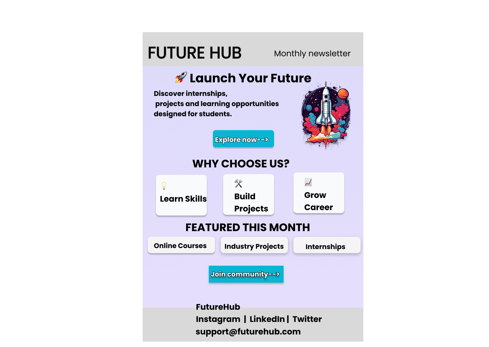

TASK2-EMAIL TEMPLATE
# Email Template Design

## Overview

This project focuses on designing a professional and visually appealing email template using Figma. The template is designed to effectively communicate information while maintaining a clean layout, consistent branding, and user-friendly structure.

## Objective

To create a responsive and attractive email template that enhances user engagement and delivers information clearly.

## Features

* Clean and modern email layout
* Professional typography
* Call-to-Action (CTA) button
* Well-structured content sections
* Consistent color scheme and branding
* Mobile-friendly design considerations

## Tools Used

* Figma
* Google Fonts
* Icons and Illustrations

## Design Process

1. Analyzed the requirements and reference design.
2. Created the email structure and content layout.
3. Designed the header, body, and footer sections.
4. Applied typography, colors, and visual hierarchy.
5. Reviewed the design for consistency and readability.

## UI/UX Principles Applied

* Visual Hierarchy
* Consistency
* Simplicity
* Readability
* User-Centered Design

## Learning Outcomes

* Improved email design skills.
* Learned layout structuring and content organization.
* Practiced creating visually appealing marketing emails.
* Enhanced understanding of UI/UX design principles.

## Deliverables

* Figma Design File
* Prototype Link
* Design Screenshot(s)
* GitHub Repository Submission

## Preview

